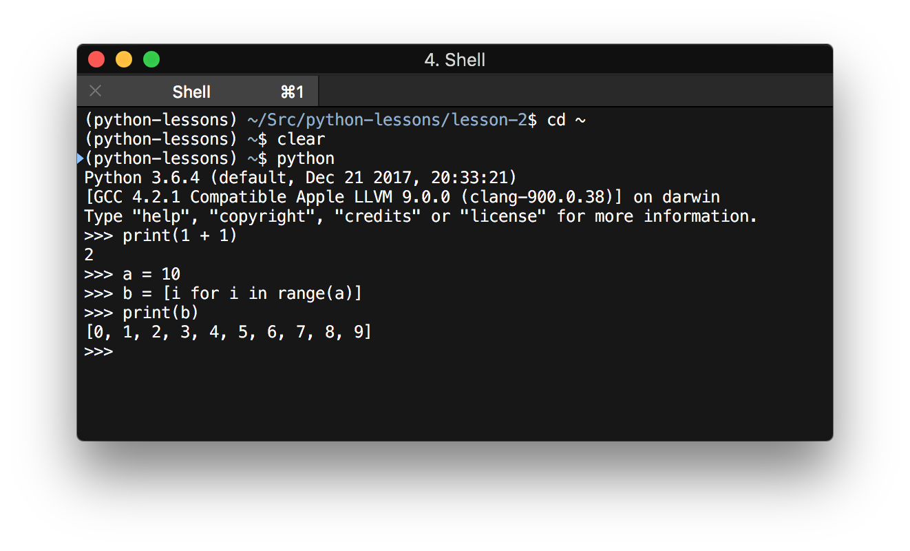

# Лекция №2

## Установка python

* Windows: 
    * https://www.python.org/ftp/python/3.6.5/python-3.6.5-amd64.exe
* MacOS:
    * https://www.python.org/ftp/python/3.6.5/python-3.6.5-macosx10.9.pkg
    * `brew install python`
* Linux:
    * `apt-get install python3`

---

## Редактор для разработки (IDE)

**Pycharm Community Edition**
Скачать: https://www.jetbrains.com/pycharm/download/

---

Запускаем python:

`$ python`

---

## Стандартная библиотека

1. Полный список модулей стандартной библиотеки: https://docs.python.org/3/library/index.html
2. `datetime`: https://docs.python.org/3/library/datetime.html
3. `os.path`: https://docs.python.org/3/library/os.path.html
4. работа с файлами: https://docs.python.org/3/tutorial/inputoutput.html

---

## Пакетный менеджер

1. `pip` - пакетный менеджер
2. `pip freeze` - вывести список установленных пакетов
3. `pip install {package}` - установка пакета

---

## Python package index

* https://pypi.org

## Полезные библиотеки:

* ipython - Удобный интерактивный python https://pypi.org/project/ipython/
* requests - HTTP-запросы https://pypi.org/project/requests/
